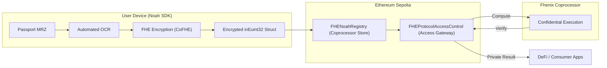

# NOAH: Privacy-Preserving KYC with Fhenix Coprocessor

**NOAH** (Network for On-chain Authenticated Handshakes) is a state-of-the-art, privacy-preserving identity protocol built on the **Fhenix Coprocessor**. it enables applications (Gaming, DeFi, and Consumer Apps) to verify user compliance (age, jurisdiction, sanctions) on Ethereum Sepolia without ever touching or storing personal data.

## 🚀 The Noah Vision: "Verify Once, Use Everywhere"

Noah eliminates the redundancy of KYC on-chain. By using Fully Homomorphic Encryption (FHE) and the Fhenix Coprocessor, users bind their identity to their wallet address once. This verification is then instantly reusable across every integrated app on Ethereum—from DeFi protocols to Web3 games—while maintaining 100% user privacy.

---


## 🌟 Use Cases

Here is what you can build with Noah:

### 1. Gaming & Web3 E-Sports
Keep your leaderboards fair. Verify that each player is a unique human behind the keyboard, putting an end to multi-accounting and bots.

### 2. Consumer Applications
Age-gate your content or services effortlessly. Prove your user is over 18 without asking them to upload a photo of their ID card to your servers.

### 3. DeFi & RWA Platforms
Onboard users securely. Meet strict KYC requirements while preserving your users' on-chain privacy.

---

## 🎨 Interactive Experience

Noah isn't just a protocol; it's a complete platform with professional presentation tools:

- **Professional Pitch Deck**: An interactive, slide-based presentation built directly into the UI to communicate Noah's value proposition to stakeholders.
- **Visual Data Flow**: A high-fidelity animated diagram that visualizes the technical process of transforming sensitive MRZ data into private ZK-Proofs.

---

## 🏗️ Architecture: Backend-less & Decentralized

Unlike legacy systems, Noah operates without a central backend for proof generation. All cryptographic heavy lifting occurs on the user's device.

### High-Level Flow



---

## 🛠️ Key Components

### 1. Noah SDK (Client-Side)
The bridge between local identity and on-chain privacy:
- **Automated OCR**: Extracts MRZ data from passport images locally.
- **CoFHE Engine**: Uses `@fhenixprotocol/js-sdk` to encrypt identity attributes (like age) client-side for the Fhenix Coprocessor.
- **Identity Binding**: Authorizes the registry/issuer to store the encrypted handle on Sepolia.

### 2. FHENoahRegistry.sol
The on-chain source of truth on Sepolia:
- **Confidential Storage**: Stores identity handles as encrypted Fhenix structs (`inEuint32`).
- **Coprocessor Ready**: Architected to support off-chain processing while maintaining on-chain integrity.
- **Access Control**: Role-gated via Trusted Issuers (Issuer Manager).

### 3. FHEProtocolAccessControl.sol
The gateway for private applications:
- **Stateless Verification**: Interfaces with the Fhenix Coprocessor to run private logic (e.g., `age > 18`) on encrypted registry data.
- **Zero Exposure**: Protocols receive a boolean verification result without ever seeing the raw encrypted data.

---

## 🛡️ Security & Privacy

### Fhenix Coprocessor
Noah leverages the **Fhenix Coprocessor (CoFHE)** to perform computations on *encrypted data*. This allows standard Ethereum contracts to benefit from FHE-powered privacy without moving all logic to a specialized chain.

### Zero-Data Architecture
- **Client-Side Encryption**: Sensitive data never leaves the user's device in plaintext.
- **Deterministic Nullifiers**: Prevents identity tracking and multi-accounting using salted hashes.

---

## 📍 Live Deployment (Sepolia)

The Noah Protocol is currently live on **Ethereum Sepolia**:

| Contract | Address |
| :--- | :--- |
| **FHENoahRegistry** | `0xd6ACEA76AAF465559Ff9F287b4F883f18368325B` |
| **Access Control** | `0x503De26148ACa67Aa97E12eC545B22e7216f1BE4` |

---

## 💻 Getting Started

### Installation
```bash
npm install noah-protocol
```

### Quick Usage (SDK)
```typescript
import { NoahSDK } from 'noah-protocol';

const sdk = new NoahSDK();

// 1. Scan Passport
const mrzData = await sdk.extractPassportData(imageFile);

// 2. Encrypt Identity (Age)
const encryptedIdentity = await sdk.user.encryptIdentity({ age: 18 });

// 3. Register on Sepolia
await sdk.user.registerIdentity(userAddress, encryptedIdentity);
```

---

## 🛠️ Development

### Prerequisites
- **Hardhat**: For deployment and testing.
- **Node.js**: v20+

### Commands
```bash
# Compile Contracts
npx hardhat compile

# Deploy to Sepolia
npx hardhat run scripts/deploy-fhe.ts --network sepolia

# Build SDK
cd sdk && npm run build
```

---

## 📜 License & Project
**Repository**: [Samuel1-ona/Noah-](https://github.com/Samuel1-ona/Noah-)  
**Status**: Live on Ethereum Sepolia (v2.0 Coprocessor)  
**Powered by**: Solidity, Fhenix, and Zama.
